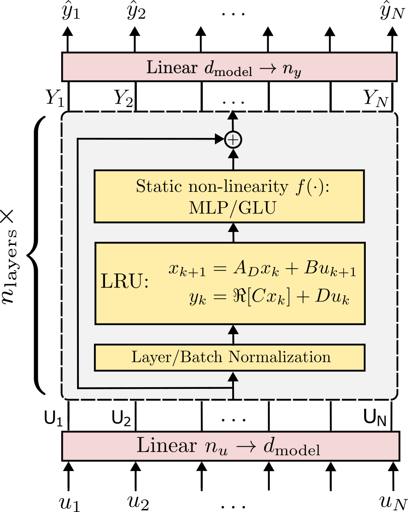

# Model order reduction of deep structured state-space models: A system-theoretic approach

This repository contains the Python code to reproduce the results of the paper [Model order reduction of deep structured state-space models: A system-theoretic approach](http://arxiv.org/abs/2308.13380)
by Marco Forgione, Manas Mejari, and Dario Piga.


## Linear Recurrent Unit
The Linear Recurrent Unit (LRU) is a sequence-to-sequence model defined by a linear dynamical system and implemented in state-space form as:
```math
\begin{align}
x_{k} = A_Dx_{x-1} + B u_k\\
y_k = \Re[C x_k] + D u_k,
\end{align}
```
where $A_D$ is diagonal and complex-valued; $B, C$ are full complex-valued; $D$ is full real-valued; and $\Re[\cdot]$ denotes the real part of its argument.

Smart parameterization/initialization of the system matrices make the LRU block easy to train numerically. Moreover, the use of [parallel scan algorithms](https://en.wikipedia.org/wiki/Prefix_sum) makes execution extremely fast on modern hardware. For more  details, read the original [LRU paper](https://arxiv.org/abs/2303.06349) from Deep Mind.

## Deep LRU Architecture

LRU units are typically organized in a deep architecture structured like:



## Model order reduction and regularization
We use Model Order Reduction (MOR) to reduce the state dimensionality of Deep LRU architectures. We implement plain truncation and singular value perturbation for the system either in modal or in balanced form, resulting in the combinations:
* Balanced Truncation (BT)
* Balanced Singular Perturbation (BSP)
* Modal Truncation (MT)
* Modal Singular Perturbation (MSP)

We intruduce regularization techniques that promote parsimonious state-space representations. We introduce the following regularizers:
* LASSO on the LRU's eigenvalues magnitude
* Hankel nuclear norm

We show that, when training is performed with these regularizers, the subsequent MOR step is significantly more effective.

# Main files

The main files are:

* [train.py](examples/f16/train.py): Training script
* [test.ipynb](examples/f16/test.ipynb): Standard testing (no MOR)
* [test_MOR.ipynb](examples/f16/test_MOR.ipynb): Testing with MOR (user-given order)
* [run_MOR_all.ipynb](examples/f16/run_MOR_all.ipynb): Sweep all model orders for all combinations of regularizers and MOR techniques
 
The training script is based on hydra to handle different configuragion. For instance, the model trained with Hankel nuclear norm minimization

```
python train.py +experiment=larg_reg_hankel
```

The configuration files defining the experiments are in the [conf](examples/f16/conf) folder.

# Software requirements
Experiments were performed on a Python 3.11 conda environment with:

 * numpy
 * scipy
 * matplotlib
 * python-control
 * pytorch (v2.2.1)
 

# Citing

If you find this project useful, we encourage you to:

* Star this repository :star: 


* Cite the [paper](https://arxiv.org/abs/2308.13380) 
```
@article{forgione2023from,
  author={Forgione, Marco and Mejari, Manas, and Piga, Dario},
  title={Model order reduction of deep structured state-space models: A system-theoretic approach}, 
  year={2024},
}
```
